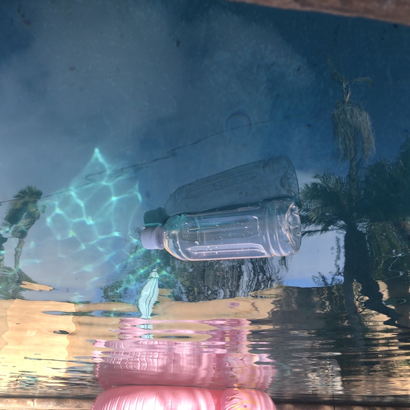

# see-trash-data
This is a custom dataset used in the detection of plastic bottles for my ["Trashboat" project](https://github.com/theTonyVal/see-trash). The dataset is comprised of 1485 images from a pool and they are all annotated.

The annotation process took 3 hours. I am not completely sure how quick or slow that is but all I know is my hand really hurt. Lmk if there is a solution that is better than LabelImg for large dataset because I do not want to do that again. :)

